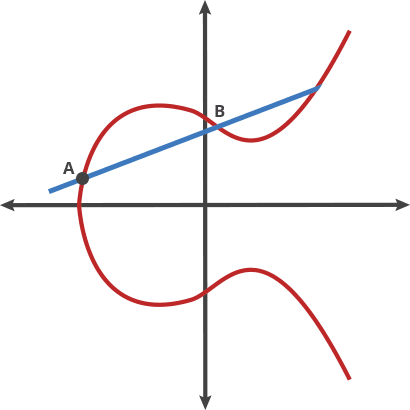

# **Introduction blockchain Ethereum**

## **DLT: Distributed ledger technology AKA Blockchain**

Les technologies blockchain ont résolu 2 problèmes:

- immuabilité: les données ne peuvent pas être modifiées
- processus distribué: plus de point d'autorité unique ou de point de défaillance unique (_«SPOF»_ : `single point of authority or a single point of failure`), chaque nœud travaille ensemble sur la base d'un mécanisme de consensus empêchant les acteurs malveillants.

### **Immutability**

Dans une blockchain, toutes les transactions sont stockées dans un bloc.
Chaque bloc comprend le `hachage cryptographique` du bloc précédent dans la chaîne, reliant les deux blocs, ainsi qu'un `hachage cryptographique` de toutes les transactions stockées dans le bloc.
Le «hachage cryptographique» est un `hachage` généré par une `fonction de hachage cryptographique`.
La «fonction de hachage cryptographique» est une fonction à sens unique (fonction non inversible) qui mappe le contenu d'un bloc à un nombre.
Ces 2 nombres, le «hachage cryptographique» du bloc précédent et le `hachage cryptographique` de toutes les transactions confirmées dans le bloc, sont stockés dans «l'en-tête du bloc» du nouveau bloc entrant.

Ci-dessous comment ce type de processus peut être implémenté avec du code:

Ci-dessous un aperçu de base d'un en-tête de bloc:

Ce processus confirme l '** intégrité ** du bloc, jusqu'au "bloc de genèse" original.

Si un acteur malveillant veut modifier un bloc, par exemple en modifiant le montant d'une transaction, il modifiera le `hachage` de toutes les transactions dans le bloc. Il devra donc miner à nouveau ce bloc. Le processus modifiera le bloc entier `hash`, et tous les blocs suivants auront un` hash` différent stocké dans leur en-tête pour le bloc précédent. L'acteur malveillant devra donc extraire également tous les blocs suivants basés sur le `hachage 'du bloc malveillant conçu.
L'autre protection qui empêche ce type de modifications est un mécanisme de consensus.
Les attaquants devraient contrôler 51% du réseau pour inverser les transactions qui ont déjà eu lieu dans une blockchain.
Ceci est connu sous le nom de ** 51% Attack **
Inutile de dire que c'est en fait impossible, les attaquants auraient besoin de beaucoup de puissance de calcul, et même s'ils réussissaient, cela invaliderait la confiance sur cette blockchain et les utilisateurs partiraient simplement.

### **Centralized vs Decentralized vs Distributed**

Dans un réseau distribué, il n'y a pas un point d'autorité unique (ni même multiple).
L'objectif est d'éviter un seul point de défaillance: `SPOF`
Ainsi, des mécanismes de consensus sont utilisés pour s'assurer que chaque nœud d'un réseau distribué fonctionne ensemble, et jamais de manière malveillante.
Dans le cas d'un réseau blockchain, des mécanismes de consensus sont utilisés pour contrôler comment une transaction blockchain peut être validée, écrite dans un bloc et exécutée.

### **Consensus mechanisms**

#### **Byzantine generals problem**

https://fr.wikipedia.org/wiki/Probl%C3%A8me_des_g%C3%A9n%C3%A9raux_byzantins

#### **Proof of work: PoW**

En francçais: ** preuve de travail **.
Il s'agit de l'algorithme de consensus original.
Avec `PoW`, les mineurs se font concurrence pour effectuer des transactions sur le réseau et ajouter de nouveaux blocs à la blockchain.
Les mineurs doivent résoudre un casse-tête difficile en utilisant la puissance de traitement de leur ordinateur.
Le casse-tête mathématique à résoudre consiste à trouver un numéro de hachage pour l'en-tête du bloc courant en manipulant le champ «nonce» de ce bloc.
Le numéro de hachage à trouver doit être inférieur à un hachage `cible`. Le hachage `cible` est défini par une `difficulté`.
! [processus d'extraction] (./ res / bitcoin_block_hashing.jpg)

Le premier mineur à résoudre le puzzle reçoit une récompense pour son travail.
Une preuve de travail est une donnée qui est difficile (coûteuse, longue) à produire mais facile à vérifier pour les autres et qui satisfait à certaines exigences.

#### **Proof of stake: PoS**

En français: ** preuve d'enjeu ** ou ** preuve de participation **.
La preuve d'enjeu (`PoS`) est un type d'algorithme de consensus par lequel un réseau de blockchain de crypto-monnaie vise à atteindre un consensus distribué.
Dans les blockchains basées sur PoS, le créateur du bloc suivant est choisi via diverses combinaisons de sélection aléatoire et de richesse ou d'âge (c'est-à-dire la mise).
Dans le cas de la blockchain Ethereum, il y aura un seuil minimum de 32 ETH requis pour participer au jalonnement, et les validateurs devront exécuter un nœud de validation. Il n’est pas nécessaire que ce soit des machines spécialisées et cela peut être fait sur un ordinateur ou un ordinateur portable grand public. Cependant, on s'attend à ce que les validateurs soient constamment en ligne ou encourent des sanctions mineures.
Dans le cas de la blockchain opérant un consensus `PoS`, les mineurs / validateurs / stakers peuvent extraire ou valider les transactions de bloc en fonction du montant de crypto-monnaies qu'ils détiennent.
Pour ajouter un bloc malveillant, un attaquant devrait posséder 51% de toute la crypto-monnaie du réseau.

Ethereum a historiquement exploité un consensus de preuve de travail. Cependant, l’une des raisons de passer à la preuve de participation est qu’elle est généralement considérée comme beaucoup plus économe en énergie que la preuve de travail.

### **Mining**

Les nœuds Miner créent des blocs dans la chaîne.
Un bloc est une structure de données qui contient un ensemble de transactions. Lors de la création d'un bloc, le mineur sélectionnera certaines transactions dans son pool de transactions en attente (transactions en attente d'être incluses dans la chaîne) et commencera à extraire le bloc.
La chose importante à savoir est que l'exploitation minière est un processus coûteux. Par conséquent, si les mineurs n’obtenaient rien en échange de l’exploitation minière, personne ne le ferait.
Dans Ethereum, lorsqu'un mineur extrait un nouveau bloc, il reçoit les frais de toutes les transactions incluses dans ce bloc et une récompense de bloc (en fait 2 ETH). Par conséquent, plus le prix du gaz est élevé dans les transactions, plus les frais perçus par le mineur seront élevés.

### **Fees/Gas**

Les frais sur la blockchain Bitcoin, ou le système `Gas` sur la blockchain Ethereum, sont un système de protection et une récompense pour les nœuds traitant la transaction.
L'informatique coûte de l'argent:

- héberger un service
- stocker des données
- traitement des informations

Chaque transaction qui modifie un état dans une blockchain, comme l'envoi de crypto-monnaies, le déploiement d'un contrat intelligent ou la modification d'une valeur dans un contrat intelligent, coûtera des frais à l'expéditeur.

Un autre aspect de la facturation de l'utilisateur pour ses actions sur le réseau est de prévenir les abus. Si vous payez pour chaque opération que vous exécutez, vous ferez de votre mieux pour implémenter votre code de la manière la plus efficace. Le coût des frais empêche également les mauvais acteurs d'inonder le système d'opérations inutiles (à moins qu'ils ne soient prêts à dépenser beaucoup d'argent pour exécuter du code inutile).

### **asymmetric cryptography**

Le cœur de la cryptographie asymétrique est l'utilisation de paires de clés publiques et privées.
Une clé privée est un nombre aléatoire. La clé publique associée est un nombre généré par un algorithme unidirectionnel basé sur la clé privée.
Cet algorithme est un algorithme de signature numérique à courbe elliptique («ecdsa» : `elliptic curve digital signature algorithm`).
La courbe elliptique utilisée par Bitcoin, Ethereum et de nombreuses autres crypto-monnaies est appelée secp256k1. L'équation de la courbe secp256k1 est `y² = x³ + 7`. Cette courbe ressemble à:

Une clé privée est un grand nombre, de préférence, généré de manière aléatoire.
La clé privée doit être gardée secrète.
Une clé publique est un grand nombre obtenu par un `ecdsa` sur la clé privée.
La clé publique peut être partagée avec n'importe qui sans compromettre la sécurité.
Une adresse est obtenue à partir d'une clé publique avec une fonction de hachage.
Une transaction contient le message de la transaction, et une signature de ce message générée avec la clé privée de l'expéditeur.
Tout le monde peut vérifier la signature générée pour:

- récupérer la clé publique et l'adresse du signataire
- vérifier l'intégrité du message, qu'il s'agit du même message qui a été signé par le signataire.

Avec la signature et le hachage des données originales, nous pouvons effectuer une `récupération de signature de courbe elliptique` et obtenir la clé publique puis l'adresse. Si l'adresse récupérée est identique à l'adresse de l'expéditeur, alors le détenteur de la clé privée de la paire de clés publiques a bien signé le message.

## **Ethereum**

### **Ethereum vs Bitcoin**

Bitcoin white paper: https://bitcoin.org/bitcoin.pdf  
Ethereum yellow paper: https://ethereum.github.io/yellowpaper/paper.pdf

Techniquement, Ethereum et Bitcoin suivent le même schéma dans leur implémentation, mais il existe 3 différences principales entre ces 2 blockchains:

- Ethereum dispose d'une machine virtuelle qui peut exécuter des instructions et stocker des données.
- Ethereum offre la possibilité de déployer et d'utiliser des `smart contracts`, une version améliorée du `Script` Bitcoin. Les instructions des `contrats intelligents` sont exécutées dans `l'EVM` et les données sont stockées dans `l'EVM`.
- Ethereum a introduit `Gas`, un système amélioré de frais de mineurs sur Bitcoin.

### **EVM**

La machine virtuelle Ethereum (`EVM`) est une puissante pile virtuelle en bac à sable intégrée dans chaque nœud Ethereum complet, responsable de l'exécution du bytecode du contrat. Les contrats sont généralement écrits dans des langages de niveau supérieur, comme Solidity, puis compilés en bytecode `EVM`.
Cela signifie que le code machine est complètement isolé du réseau, du système de fichiers ou de tout processus de l'ordinateur hôte. Chaque nœud du réseau Ethereum exécute une instance `EVM` qui leur permet de s'entendre sur l'exécution des mêmes instructions. `L'EVM` est Turing complet, qui fait référence à un système capable d'exécuter n'importe quelle étape logique d'une fonction de calcul.
Pour chaque instruction implémentée sur `l'EVM`, un système qui garde la trace du coût d'exécution, attribue à l'instruction un coût associé en unités de gaz. Lorsqu'un utilisateur souhaite lancer une exécution, il réserve de l'éther, qu'il est prêt à payer pour ce coût de gaz.
Liste des opcodes EVM: https://ethervm.io/

### **Smart contracts**

Un contrat intelligent est un contrat auto-exécutable dont les termes de l'accord entre l'acheteur et le vendeur sont directement écrits dans des lignes de code.
Les contrats intelligents permettent d'exécuter des transactions et des accords de confiance entre des parties disparates et anonymes sans avoir besoin d'une autorité centrale, d'un système juridique ou d'un mécanisme d'application externe.
Un contrat intelligent est un ensemble de fonctions et de données stockées dans l'EVM.
Les contrats intelligents peuvent exécuter des instructions, mais sont limités par une petite liste d'opcodes disponibles et également par la `Limite de gaz`, le montant maximum de `Gaz` qu'un utilisateur est prêt à payer.

### **Gas**

Seules les transactions en lecture seule sont gratuites. Sinon, l'expéditeur doit payer le montant de `Gas` nécessaire lorsqu'il envoie une transaction à la blockchain Ethereum.
Il existe 3 principaux cas d'utilisation de `Gas`:

- récompense pour le mineur qui a miné le bloc. Il gagnera tous les frais de `gaz` dépensés pour toutes les transactions par bloc extrait.
- éviter les attaques `DDoS`. Comme les transactions ont besoin d'un montant `gaz`, une attaque `DDoS` nécessite une énorme quantité de crypto-monnaies pour payer ce coût `gaz`.
- protection de l'utilisateur. Le `gasLimit` est utilisé pour empêcher l'utilisateur de gaspiller son Ether à cause d'un bug dans un contrat intelligent ou d'erreurs d'estimation.

L'analogie bien connue pour comprendre le terme `gaz` est la voiture et le carburant.
Si vous possédez une voiture et que vous devez la conduire du point A au point B, vous avez besoin d'une quantité de carburant. De la même manière, si vous avez des opérations que vous souhaitez exécuter dans l'Ethereum EVM, vous avez besoin de `Gas`. Avec votre voiture, plus vous roulez, plus vous avez besoin de carburant. Dans Ethereum, plus vous calculez, plus vous avez besoin de gaz.
La quantité de `gaz` nécessaire est spécifiée dans l'annexe G du livre jaune.

Le `gasPrice` est la valeur que l'expéditeur de la transaction est prêt à payer par unité `Gas`.
En suivant l'analogie voiture / carburant, si votre voiture a un réservoir de 50 litres, combien payez-vous pour remplir complètement le réservoir? La réponse dépend du prix du litre dans la pompe.
Il en va de même avec Ethereum et `Gas`, si vous avez une transaction qui nécessite 10 gaz à exécuter, le prix que vous payez pour exécuter cette transaction dépend du prix par unité de gaz.

Le `gasLimit` est le `gaz` maximum que l'expéditeur de la transaction est prêt à dépenser pour exécuter cette transaction. Parfois, lors de l'exécution d'une transaction, vous ne savez peut-être pas exactement combien cela va coûter. Imaginez un scénario où vous avez un contrat intelligent avec un bug, une boucle infinie. Sans gasLimit, il serait possible de consommer la totalité du solde du compte émetteur. Le `gasLimit` est un mécanisme de sécurité pour empêcher quelqu'un d'utiliser tout son Ether en raison d'un bug ou d'une erreur d'estimation.

Ainsi, lorsqu'un utilisateur envoie une transaction, il paiera un premier montant de:
** Coût initial = `gasPrice` \ *` gasLimit` **
Si le coût intrinsèque est supérieur au solde du compte émetteur, la transaction est considérée comme invalide. Une fois la transaction traitée, tout gaz non utilisé est remboursé sur le compte de l'expéditeur. Ainsi, un utilisateur paiera lorsque la transaction sera traitée:
** Coût réel = `gasPrice` \ *` gasUsed` **
Cependant, si votre transaction tombe en panne d'essence lors de l'exécution, il n'y a pas de remboursement. C'est pourquoi, généralement, l'expéditeur de la transaction définit le gasLimit sur une valeur supérieure à la quantité estimée de gaz.

Si le réseau Ethereum n'est pas encombré, les coûts et `gasPrice` sont bon marché. C'est pourquoi ils sont exprimés dans une dénomination plus petite que l'Ether:

| Unité | Valeur Wei | Wei |
| ------------------- | --------- | ------------------------- |
| wei | 1 wei | 1 |
| Kwei (babbage) | 1e3 wei | 1 000 |
| Mwei (lovelace) | 1e6 wei | 1 000 000 |
| Gwei (shannon) | 1e9 wei | 1 000 000 000 |
| microéther (szabo) | 1e12 wei | 1 000 000 000 000 |
| milliéther (finney) | 1e15 wei | 1 000 000 000 000 000 |
| éther | 1e18 wei | 1 000 000 000 000 000 000 |

 
Un mineur donnera toujours la priorité aux transactions avec un coût de gaz plus élevé.
Les personnes qui envoient des transactions spécifient un prix du gaz et les mineurs décident des transactions à miner dans un bloc. Les deux se rencontrent quelque part au milieu sur un prix.

Lors de l'envoi d'une transaction, il peut être difficile de savoir quel est le prix minimum de l'essence à ce moment-là. Il existe quelques outils qui analysent le réseau et le prix moyen du gaz utilisé dans les transactions récentes pour aider à choisir un gaz équitable Prix qui est susceptible d'être accepté par les mineurs:
Station-service ETH: https://ethgasstation.info/
Suivi du gaz Etherscan: https://etherscan.io/gastracker
Addons de navigateur: https://addons.mozilla.org/en-US/firefox/addon/ethereum-gas-price-extension/